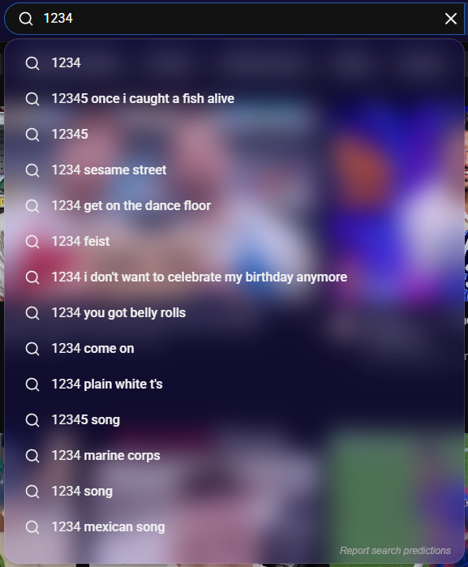

# Glassmorphism for YouTube

A Chrome extension that transforms the YouTube interface into a modern **glassmorphism** theme, with frosted-glass surfaces, soft borders, rounded corners and adjustable blur.

## Screenshots

### Left menu

The floating glass sidebar with three different blur settings:

| Low blur | Medium blur | High blur |
| :---: | :---: | :---: |
|  |  |  |

### Search suggestions

The search dropdown uses the same glass look, and it follows the blur slider and the menu color from the popup.

  

### Settings popup

Turn the effect on or off, change the blur and pick the menu color. Changes apply instantly.

  

## Features

- **Frosted search bar** with a subtle glow when focused
- **Glass search suggestions** dropdown
- **Glass masthead** (top bar) that adapts to light and dark mode
- **Floating glass sidebar** (left menu) on the home page, with its own scroll bar
- **Glass mini guide** (collapsed sidebar) and hamburger drawer while watching a video
- **Glass contextual panels**: 3-dot menus and sheets, the notifications panel and the video player right-click menu
- **Live settings popup**: changes apply instantly to open YouTube tabs
  - **On/off switch**: turn the whole glass effect off and get the original YouTube look back
  - **Blur slider**: adjust the blur intensity from 0 to 50 px
  - **Left menu color**: pick any color for the glass panels

## Installation

The extension is not on the Chrome Web Store, so you load it manually:

1. Download this repository as a ZIP and extract it.
2. Open `chrome://extensions` in Chrome (or any Chromium-based browser).
3. Turn on **Developer mode** (top right).
4. Click **Load unpacked** and select the `Glassmorphism for Youtube` folder (the one that contains `manifest.json`).
5. Open [YouTube](https://www.youtube.com). The theme is applied automatically.

## Usage

Click the extension icon in the toolbar to open the settings popup:

| Setting | Description |
| --- | --- |
| Glassmorphism Effect (switch) | Turns the glass theme on or off |
| Blur Slider | Controls how strong the frosted-glass blur is (0-50 px) |
| Left Menu Color | Sets the tint color of the glass panels (left menu, menus and dropdowns) |

Your settings are saved automatically and restored the next time you open YouTube.

## Privacy

The extension does not collect, transmit or share any data. Your settings are stored locally using `chrome.storage.local`. The extension only needs the `storage` permission and only runs on `www.youtube.com`.

## Known limitations

- The theme is designed for Chromium-based browsers using Manifest V3.
- It only works on `www.youtube.com`, not on YouTube Studio or YouTube Music.
- YouTube changes its page structure from time to time, so some parts of the theme may need updates.

## Version
`1.0`
