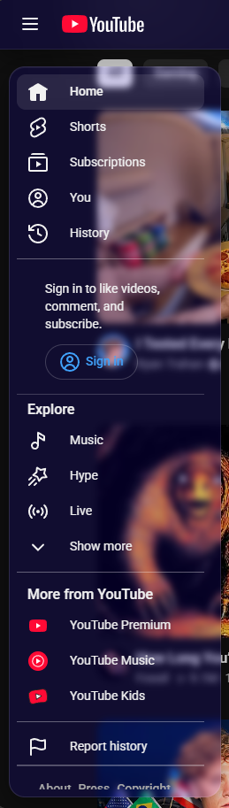
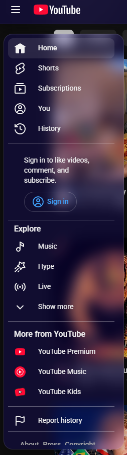
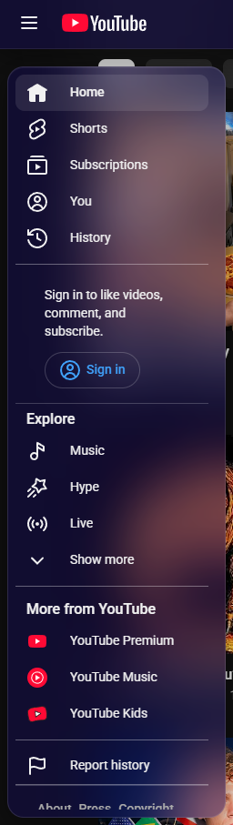
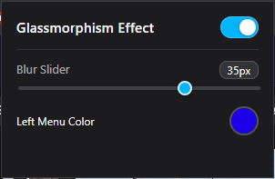

# Glassmorphism for YouTube

A Chrome extension that gives YouTube a modern **glassmorphism** look: frosted-glass panels, soft borders, rounded corners and a blur you can adjust, all with a single click on the toolbar icon.

## Screenshots

The floating left menu with three different blur settings:

| Low blur | Medium blur | High blur |
| :---: | :---: | :---: |
|  |  |  |

## Features

- **Frosted search bar** with a soft glow when it is focused
- **Glass top bar** (masthead) that adapts to light and dark mode
- **Floating glass left menu** on the home page, with its own slim scroll bar
- **Glass mini guide** (collapsed sidebar) and **hamburger menu** while you watch a video
- **Glass menus and sheets**: the 3-dot menus and the video player right-click menu
- **Live settings popup**: changes apply instantly to every open YouTube tab
  - **On/off switch**: turn the whole effect off and get the original YouTube look back
  - **Blur slider**: set the blur from 0 to 50 px
  - **Left menu color**: pick the tint of the glass panels

## Installation

The extension is not on the Chrome Web Store, so you load it manually:

1. Download this repository as a ZIP and extract it.
2. Open `chrome://extensions` in Chrome (or any Chromium-based browser).
3. Turn on **Developer mode** (top right).
4. Click **Load unpacked** and select the `Glassmorphism for Youtube` folder (the one that contains `manifest.json`).
5. Open [YouTube](https://www.youtube.com). If it was already open, refresh the tab once. The theme is applied automatically.

## Usage

Click the extension icon in the toolbar to open the settings popup:

  

| Setting | Description |
| --- | --- |
| Glassmorphism Effect (switch) | Turns the glass theme on or off |
| Blur Slider | Controls how strong the frosted-glass blur is (0-50 px) |
| Left Menu Color | Sets the tint color of the left menu and the other glass panels |

Your settings are saved automatically and restored the next time you open YouTube.

## Privacy

The extension does not collect, transmit or share any data. Your settings are stored locally using `chrome.storage.local`, and the extension only runs on `youtube.com`.

## Known limitations

- The theme is designed for Chromium-based browsers using Manifest V3.
- It is made for the main YouTube site. It has no effect on YouTube Studio or YouTube Music.
- After you switch the effect off, the left menu may in rare cases need a page refresh to return fully to its original layout.
- YouTube changes its page structure from time to time, so some parts of the theme may need updates.

## License

See the [LICENSE](LICENSE) file.

## Version

`1.0`
